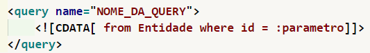

<h2>Guia de como usar esse template de hibernate</h2>

Aqui as instruções para uso, aqui contém uma lista de dialetos e drivers para serem usados no hibernate.cfg.xml

<h2>Arquivo hibernate.cfg.xml</h2>
<h3>Observações</h3>

<h2>Arquivo "CLASSE".hbm.xml</h2>
<h3>Observações</h3>

Esse arquivo deve estar na pasta src da aplicação dentro da raiz, pode acontecer de dar erros de compilação caso esse arquivo não esteja no diretório correto. 
Alem disso tomar cuidado com o Doctype, o mesmo precisa ser valido para a aplicao funcionar, de preferencia copie e cole o que esta ali, mas antes disso, coloque
o link no navegador e veja se esse doctype é válido, pois qualquer erro desse tipo pode condenar a renderização desse arquivo xml. Por fim apague os comentários
nos templates e substitua os valores no XML pelo equivalente ao banco de dados que você possui.

<h2>"component"</h2>

Através dessa propriedade você pode fazer com que uma tabela no banco de dados, seja representado por duas ou mais entidades, isso pode ser muito util, 
caso você tenha uma tabela muito grande ou que não seja normalizada. Coloque dentro da tag class:

<h2>Criação de ID</h2>

Para referenciar uma id temos 2 formas de fazer isso:

<h3>Caso voce queira que a aplicao gerencie a aplicacao:</h3>

<h3>Caso voce queira que o banco de dados gerencie a aplicacao:</h3>

<h3>Caso voce precise colocar uma colection:</h3>

Essa seria uma outra forma de voce adicionar um relacionamento mais fraco a entidade, nesse caso o lado N da relação.

<h3>Colocando a Query dentro do arquivo XML</h3>

Caso voce queira incluir a query no arquivo xml, coloqueo dentro da tag query.
        O mesmo deve estar dentro de um CDATA para que nao seja interpolado, na hora 
        de compilar o XML, ou seja isso pode dar erro se nao estiver dentro de CDATA.
        a query deve ter pelo menos um nome, ao qual sera usado para acessar essa query
        salva aqui. Essa query ela requer um parametro, mas eh perfeitamente possivel
        criar uma query aqui que nao exija parametro. Para fazer uso, use o metodo 
        getNameQuery de um objeto org.hibernate.Session. Dentro do metodo 
        "getNamedQuery(queryName)", aonde esta queryName, voce passa em formato de 
        String o nome da query, nesse caso ficaria: 
        seuObjeto.getNamedQuery("NOME_DA_QUERY");         
        Porem voce deve salvar esse resultado dentro de um Objeto org.hibernate.query.Query
        Para isso voce deve seguir o padrao abaixo:
        org.hibernate.query.Query query = objetoSession.seuObjeto.getNamedQuery("NOME_DA_QUERY");
        CASO TENHA PARAMETRO, FACA O SEGUINTE, MAS APENAS SE TIVER PARAMETRO:
        query.setString(name, val) -> name o nome do atributo na query, nesse exemplo abaixo 
        voce colocaria "parametro", entre String e sem os dois pontos, no val voce colocaria
        o valor a substituido no lugar do :parametro (nesse caso em especifico), em formato
        de string. Porem caso o valor nao seja string, o valor a ser informado, voce pode
        por exemplo mudar de setString para setSEUTIPO, assim sendo: query.setInteger("nome","valor"),
        por exemplo, em algumas queries em que se exige valores inteiros, pode se dar problemas
        ao usar o setString, como o between o in, ou ate mesmo para alguma operacao aritimetica,
        se esse erro o ocorrer, troque o setString para o valor apropriado. Lembrando, se houver
        mais de um parametro essa funcao "set" deve ser executada mais de uma vez, se por exemplo,
        houver um valor inteiro e um valor string, entao deve Executar um setInteger e depois um 
        setString, siga sempre a sequencia da esquerda para a direita ao definir parametros para
        manter a ordem e a organizacao.               
        Voce poderia caso nao tenha nenhum parametro na query, ja executar a query e ja passar o 
        resultado direto para um List, exemplo:
        objetoSession.seuObjeto.getNamedQuery("NOME_DA_QUERY").list();
        Mas lembre-se ao chamar o metodo list acima a query sera executada, e nisso, se houver
        parametro(s) os mesmos deveram ser substituidos, antes de ocorrer a execucao da query,
        impossibilitando o uso caso tenha parametros. Caso opte por usar o metodo acima, isso
        te livra de criar um objeto Query.
        Voce pode contar com o metodo do Objeto Query, que implementa a interface Query, 
        eles contem o setMaxResults(InteiroResultadoMaximo), sendo InteiroResultadoMaximo o numero
        maximo de resultados permitidos e setFirstResult(InteiroDaOndeInicia), que define o ponto
        de partida, exemplo se colocar o valor 1 como InteiroDaOndeInicia, o resultado comecara
        da segunda ocorrencia, de toda forma voce pode usar o objeto Query que implementa uma
        interface de mesmo nome para trabalhar com essa query abaixo.
        Voce tambem pode usar a APi criteria no lugar da Query:
        Criteria crit = session.createCriteria(SuaEntidade.class);
        List results = crit.list()
        Para mais informacoes: https://docs.jboss.org/hibernate/orm/3.2/api/org/hibernate/Criteria.html
        Query: https://docs.jboss.org/hibernate/orm/3.2/api/org/hibernate/Query.html
        Session: https://docs.jboss.org/hibernate/orm/3.5/javadocs/org/hibernate/Session.html
        Para isso voce tem no Hibernate, o Query, o Criteria API e o proprio sql puro, o que muda eh 
        apenas a forma de trabalhar.

