<h2>Guia de como usar esse template de hibernate</h2>

Aqui as instruções para uso, aqui contém uma lista de dialetos e drivers para serem usados no hibernate.cfg.xml

<h2>Arquivo hibernate.cfg.xml</h2>
<h3>Observações</h3>

<h2>Arquivo "CLASSE".hbm.xml</h2>
<h3>Observações</h3>

Esse arquivo deve estar na pasta src da aplicação dentro da raiz, pode acontecer de dar erros de compilação caso esse arquivo não esteja no diretório correto. 
Alem disso tomar cuidado com o Doctype, o mesmo precisa ser valido para a aplicao funcionar, de preferencia copie e cole o que esta ali, mas antes disso, coloque
o link no navegador e veja se esse doctype é válido, pois qualquer erro desse tipo pode condenar a renderização desse arquivo xml. Por fim apague os comentários
nos templates e substitua os valores no XML pelo equivalente ao banco de dados que você possui.

<h2>"component"</h2>

Através dessa propriedade você pode fazer com que uma tabela no banco de dados, seja representado por duas ou mais entidades, isso pode ser muito util, 
caso você tenha uma tabela muito grande ou que não seja normalizada. Coloque dentro da tag class:

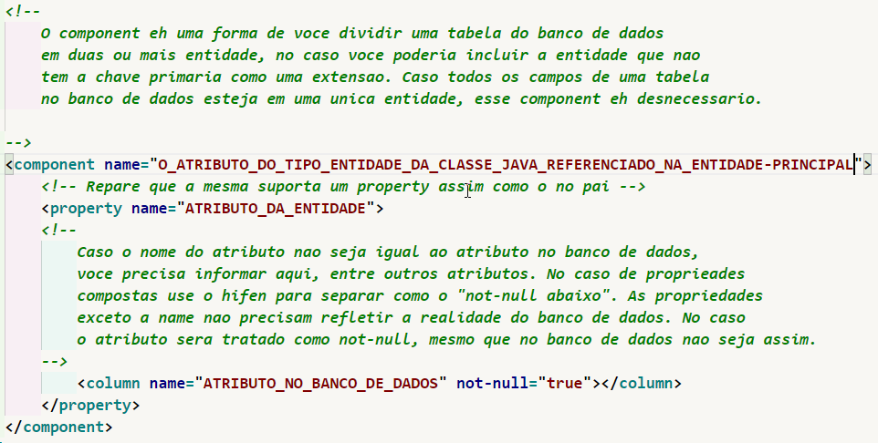

<h2>Criação de ID</h2>

Para referenciar uma id temos 2 formas de fazer isso:

<h3>Caso voce queira que a aplicao gerencie a aplicacao:</h3>

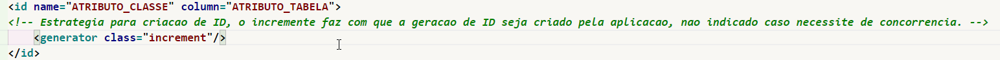

<h3>Caso voce queira que o banco de dados gerencie a aplicacao:</h3>

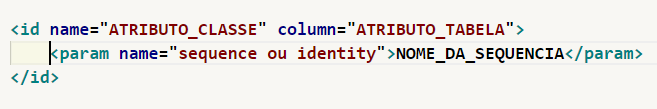

<h3>Criacao de Chave Estrangeira com base na chave estrangeira:</h3>

Essa estrategia transforma a chave primaria dessa tabela em chave primaria e estrangeira da tabela referenciada abaixo.

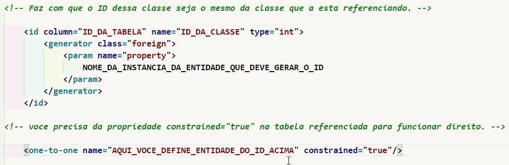

<h2>Caso voce precise colocar uma collection:</h2>

Essa seria uma outra forma de voce adicionar um relacionamento mais fraco a entidade, nesse caso o lado N da relação.

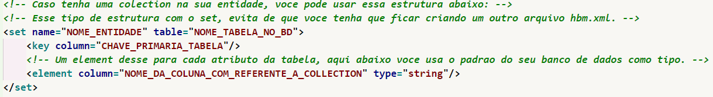

<h2>Colocando a Query dentro do arquivo XML</h2>

Caso voce queira incluir a query no arquivo xml, coloqueo dentro da tag query.
        O mesmo deve estar dentro de um CDATA para que nao seja interpolado, na hora 
        de compilar o XML, ou seja isso pode dar erro se nao estiver dentro de CDATA.
        a query deve ter pelo menos um nome, ao qual sera usado para acessar essa query
        salva aqui. Essa query ela requer um parametro, mas eh perfeitamente possivel
        criar uma query aqui que nao exija parametro. Para fazer uso, use o metodo 
        "<b>getNameQuery</b>" de um objeto "<b>org.hibernate.Session</b>". Dentro do metodo 
        "<b>getNamedQuery(queryName)</b>", aonde esta queryName, voce passa em formato de 
        String o nome da query, nesse caso ficaria:  
        <pre>seuObjeto.getNamedQuery("NOME_DA_QUERY");</pre> 
        Porem voce deve salvar esse resultado dentro de um Objeto "<b>org.hibernate.query.Query</b>"
        Para isso voce deve seguir o padrao abaixo: 
        <pre>org.hibernate.query.Query query = objetoSession.seuObjeto.getNamedQuery("NOME_DA_QUERY");</pre> 
        <h3>Necessário apenas se tiver parametro na Query:</h3> 
        <b>query.setString(name, val) -> name o nome do atributo na query, nesse exemplo abaixo </b>
        voce colocaria "parametro", entre String e sem os dois pontos, no val voce colocaria
        o valor a substituido no lugar do "<b>:parametro </b>"(nesse caso em especifico), em formato
        de string. Porem caso o valor nao seja string, o valor a ser informado, voce pode
        por exemplo mudar de <b>setString</b> para <b>setSEUTIPO</b>, assim sendo: 
        <b>query.setInteger("nome","valor")</b>",
        por exemplo, em algumas queries em que se exige valores inteiros, pode se dar problemas
        ao usar o setString, como o between o in, ou ate mesmo para alguma operacao aritimetica,
        se esse erro o ocorrer, troque o setString para o valor apropriado. Lembrando, se houver
        mais de um parametro essa funcao "set" deve ser executada mais de uma vez, se por exemplo,
        houver um valor inteiro e um valor string, entao deve Executar um setInteger e depois um 
        setString, siga sempre a sequencia da esquerda para a direita ao definir parametros para
        manter a ordem e a organizacao.              
        <h3>Opcional caso não exista parametros:</h3>
        Voce poderia caso nao tenha nenhum parametro na query, ja executar a query e ja passar o 
        resultado direto para um List, exemplo: 
        <pre>objetoSession.seuObjeto.getNamedQuery("NOME_DA_QUERY").list();</pre> 
        Mas lembre-se ao chamar o metodo list acima a query sera executada, e nisso, se houver
        parametro(s) os mesmos deveram ser substituidos, antes de ocorrer a execucao da query,
        impossibilitando o uso caso tenha parametros. Caso opte por usar o metodo acima, isso
        te livra de criar um objeto "<b>Query</b>".
        Voce pode contar com o metodo do Objeto Query, que implementa a interface Query, 
        eles contem o <b>setMaxResults(InteiroResultadoMaximo)</b>, sendo <b>InteiroResultadoMaximo</b> o numero
        maximo de resultados permitidos e <b>setFirstResult(InteiroDaOndeInicia)</b>, que define o ponto
        de partida, exemplo se colocar o valor 1 como InteiroDaOndeInicia, o resultado comecara
        da segunda ocorrencia. 
        <h3>Para mais informações sobre queries:</h3>
        Voce tambem pode usar a APi criteria no lugar da Query: 
        <pre>Criteria crit = session.createCriteria(SuaEntidade.class); 
        List results = crit.list()</pre> 
        Para mais informacoes: https://docs.jboss.org/hibernate/orm/3.2/api/org/hibernate/Criteria.html 
        Query: https://docs.jboss.org/hibernate/orm/3.2/api/org/hibernate/Query.html 
        Session: https://docs.jboss.org/hibernate/orm/3.5/javadocs/org/hibernate/Session.html 
        Para isso voce tem no Hibernate, o Query, o Criteria API e o proprio sql puro, o que muda eh 
        apenas a forma de trabalhar.

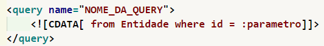

<h2>Relacionamentos Com outras Entidades</h2>
<h3>Propriedade: Cascade</h3>

O Cascade informa como sera feito esse relacionamento, entre as entidades
                existe varias formas de estabelecer esse relacionamento, nesse caso qualquer 
                alteracao feito na instancia, se reflitira na tabela ao qual a instancia
                pertence. Por exemplo se o cascade for save ou update, qualquer valor
                atualizado na instancia sera refletido na tupla no Banco de dados ao fim da 
                transacao. Caso voce nao informe o cascade, caso voce insira ou atualiza
                algum valor na instancia, o mesmo nao ira ser registrado na tupla, exceto
                que voce faca outra transacao, ao qual voce fara usando a outra entidade
                ao qual eh referenciada abaixo. De toda forma para que o relacionamento
                funcione em operacoes como insercao, remocao ou atualizacao, o mesmo
                deve ser definido com o cascade, do contrario essa relacao apenas 
                acontecera quando a aplicacao ler dados.
                oneOrMany-to-oneOrMany -> cria um join, assim sendo a relacao ocorre apenas em relacoes
                do tipo select. Ou seja quando eh feito a conexao e o acesso aos dados.
                cascade -> define o relacionamento das entidades, nesse caso como que 
                as alteracoes feitas nas instancias se refletirao na tupla da tabela
                ao qual a entidade referenciada representa, podendo estabelecer algum
                tipo de restricao, ou seja apenas inserir, crud completo, ou apenas
                atualizacao e insercao por exemplo. Quando com o valor all, logo eh completo,
                ou seja o que for feito na instancia se refletira na tupla, independente
                do que acontecao com o valor, podendo ser perigoso na exclusao por exemplo.
                

<h3>Propriedade: not-null</h3>

Se true, eh permitido que o valor na chave estrangeira seja nulo. Atributo valido apenas para relacionamento 1 para N

<h3>Propriedade: foreign-key</h3>

O atributo foreign-key caso voce queira renomear o relacionamento entre essa chave estrangeira e o id da tabela relacionada no banco de dados.

<h3>Propriedade: unique</h3>

Se true o relacionamento Many to one se comporta como um relacionamento one-to-one. No caso o relacionamento one-to-one passa a ter uma chave
estrangeira no banco de dados, o hibernate quando voce faz o relacionamento 1 para 1, ele nao cria necessariamente esse relacionamento no banco
de dados, no caso de um one-to-one simples, ele simplesmente faz duas operacoes dependendo do valor do cascade. Para que voce construa esse relacionameto
entre as chaves primarias, uma das estrategias eh colocar o many-to-one ou o one-to-many e ai definir como unique, assim ele adiciona o unique no
relacionamento da chave estrangeira, fazendo com que na pratica essa cardinalidade seja um para um, uma vez que o unique evita com que haja repeticoes.

<h3>Propriedade: column</h3>

Esse atributo deve estar nos relacionamento many to one, aqui eh definido o nome do atributo da chave estrangeira no Banco de Dados.
Por exemplo se voce tiver uma chave estrangeira, esse campo define o nome que o atributo integer contendo o valor do ID da outra tabela
deve ter. No caso se tiver um colunm, isso permite com que a relacao ocorra sem que voce precise criar um atributo na entidade para
receber o valor de id da tabela correspondente, ou seja esse valor apenas existe no banco de dados e nao na aplicacao, porem isso apenas
funciona como atributos de relacionamentos, como "one-to-one", "one-to-one", "many-to-one", "many-to-many", agora quando atributo
de um property por exemplo, ela ja se comporta como o nome do atributo da tabela no banco de dados, por exemplo, se voce tem um atributo
em uma entidade e esse mesmo atributo tem um nome diferente no banco de dados, voce referencia o nome dele na entidade como propriedade "name",
e referencia o nome que o atributo name no banco de dados, isso deve ser feito caso o nome do atributo da entidade nao tenha o mesmo nome que
o atributo la no banco de dados, sob o risco de dar erro no hibernate. 

<h3>Propriedade: fetch</h3>

 Aqui voce define como que o hibernate ira trabalhar o relacionamento, voce pode escolher entre select e fetch, o padrao
varia de acordo com o relacionamento, podendo ser estabelecido um tipo quando voce impoe um valor ao fetch. 
Quando o valor do fetch eh "select", o hibernate ira preencher uma entidade e depois a outra, preenchendo assim o relacionamento usando 2 selects,
no caso ela preenche a entidade dona do relacionamento com os dados do banco de dados e depois com um segundo select, sera preenchido a entidade
com os dados correspondente no banco de dados da entidade ao qual esta sendo alvo do relacionamento. Porem com "join", as duas entidades sao preenchidas
simultaneamentes usando algum join ao inves de dois select, veja: 
<b>fetch="select"</b>, Exemplo: <pre>select id,campo from EntidadeForte; select id, campo from EntidadeRelacionada;</pre> 
<b>fetch="join"</b>, Exemplo:  <pre>select f.id,f.campo, r.id,r.campo from EntidadeForte as f, EntidadeRelacionada as r where f.id = r.id;</pre> 
Com o fetch voce pode escolher se o hibernate vai usar mais select ou se ele vai fazer algum join, quando for resgatar dados do banco e montar o relacionamento com as entidades.

<h3>One To One</h3>

 Dessa forma voce faz que voce usa a notacao one para one no hibernate, 
                Voce especifica no class a entidade a ser relacionada aqui, e no name
                voce especifica o nome da instancia da entidade. Lembrando que a sua
                entidade, a que foi estipulada no name la em cima, deve ter uma instancia
                dessa Entidade que esta sendo referenciada aqui. Por debaixo dos panos
                o hibernate faz um join entre as tabelas no banco de dados de maneira
                automatica, isso quando resgata valores do banco, ao modificar precisa
                do cascade para definir como isso sera feito. Voce tambem pode colocar 
                esse one-to-one na outra entidade, fazendo assim um one-to-one bidirecional. 
                Sobre o cascade, Para relacionamento 1 para 1, pode-se deixar o all, uma vez que uma tupla
                depende da outra, agora se fosse um relacionamento 1 para N ou N para N
                ai o all poderia dar um problema, ou seja se outros valores usassem dessa
                instancia, provavelmente seriam afetados, mas como eh um para um o relacionamento,
                entao recomenda-se o uso do all, para que se tenha um crud completo atraves
                da entidade referenciada no no pai na propriedade name.                

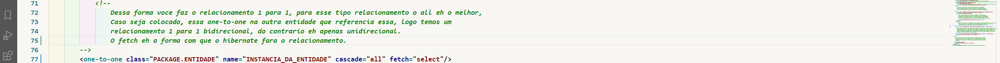

<h3>Many To One</h3>

Dessa forma se faz o relacionamento many to one, os atributos permitidos sao semelhantes ao do one-to-one,
            o column serve tabem para a anotacao acima, a mesma deve ser usada caso voce queira que especificar o
            nome da coluna de chava estrangeira que essa entidade ao qual contem o relacionamento tem. 
            

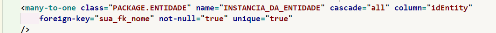

<h3>Usando um composite-id</h3>

Essa estrategia abaixo pode ser interessante caso voce queira que a tabela associativa tenha mais atributos alem das duas ou mais chaves estrangeiras.

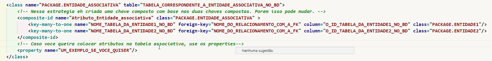

<h3>Join</h3>

O Join cria o relacionamento apenas no banco de dados, ou seja nao se faz necessario ter entidade para ela. Pode ser interessante caso voce nao queira 
ter tabelas associativas sendo representadas como entidades por exemplo.

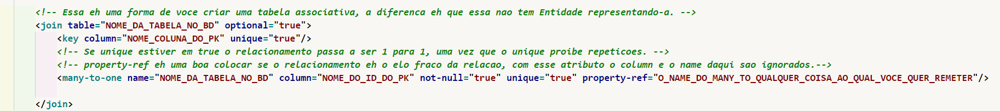

<h3>SET</h3>

Abaixo temos um exemplo de como funciona o SET, o SET ele cria um container de relacionamento, o atributo key eh obrigatorio. Ele eh sempre util quando nas classes many do relacionamento,one_ou_manyToMany

O Atributo Inverse joga a responsabilidade da geracao da foreign key a tabela relacionada se estiver setado como true, ou ela pode ser gerado apartir do campo key se estiver setado como falso.

<h4>ONE to ONE no SET</h4>

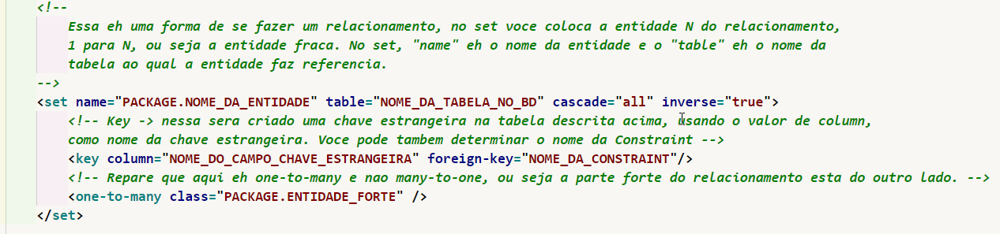

<h4>MANY to MANY no SET</h4>

