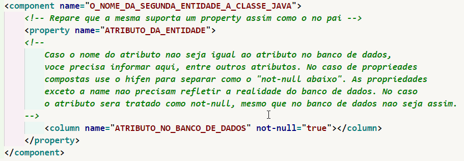
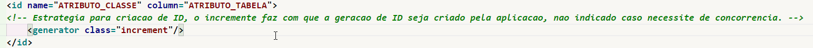
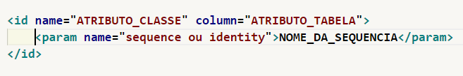
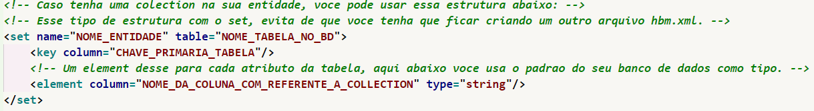

<h2>Guia de como usar esse template de hibernate</h2>

Aqui as instruções para uso, aqui contém uma lista de dialetos e drivers para serem usados no hibernate.cfg.xml

<h2>Arquivo "CLASSE".hbm.xml</h2>
<h3>Observações</h3>

<h2>Arquivo hibernate.cfg.xml</h2>
<h3>Observações</h3>

Esse arquivo deve estar na pasta src da aplicação dentro da raiz, pode acontecer de dar erros de compilação caso esse arquivo não esteja no diretório correto. 
Alem disso tomar cuidado com o Doctype, o mesmo precisa ser valido para a aplicao funcionar, de preferencia copie e cole o que esta ali, mas antes disso, coloque
o link no navegador e veja se esse doctype é válido, pois qualquer erro desse tipo pode condenar a renderização desse arquivo xml. Por fim apague os comentários
nos templates e substitua os valores no XML pelo equivalente ao banco de dados que você possui.

<h2>"component"</h2>

Através dessa propriedade você pode fazer com que uma tabela no banco de dados, seja representado por duas ou mais entidades, isso pode ser muito util, 
caso você tenha uma tabela muito grande ou que não seja normalizada. Coloque dentro da tag class:

<h2>Criação de ID</h2>

Para referenciar uma id temos 2 formas de fazer isso:

<h3>Caso voce queira que a aplicao gerencie a aplicacao:</h3>

<h3>Caso voce queira que o banco de dados gerencie a aplicacao:</h3>

<h3>Caso voce precise colocar uma colection:</h3>

